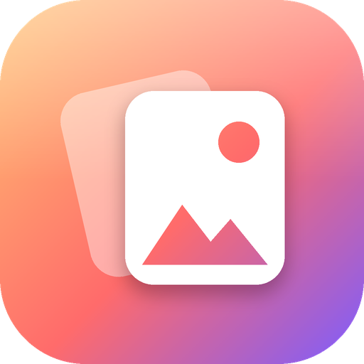

<p align="center"></p>

<h1 align="center">Refis</h1>

<p align="center">
  Локальная библиотека референсов для художников — разложить, найти, порисовать.<br>
  <i>A local reference library for artists — organize, find, practice.</i>
</p>

<p align="center">
  <a href="../../releases/latest"><b>⬇ Скачать для Windows</b></a> ·
  <a href="#возможности">Возможности</a> ·
  <a href="#english">English</a> ·
  <a href="LICENSE">MIT</a>
</p>

---

Refis наводит порядок в папках с референсами, своими работами и видеоуроками и превращает их в материал для практики:
референс дня и задания «Нарисуй это» строятся из **ваших** тем. Всё работает на вашем компьютере, без облака и регистрации.
Файлы остаются там, где лежат, — Refis только строит каталог и удаляет что-то, лишь когда вы сами попросите (в Корзину).

## Установка

1. Откройте **[последний релиз](../../releases/latest)** и скачайте `Refis-Setup-….exe`.
2. Запустите установщик — права администратора не нужны, появятся ярлыки в «Пуске» и на рабочем столе.

> **Windows может показать синее окно SmartScreen «Windows защитил ваш компьютер».** Это предупреждение
> для всех программ без платного сертификата подписи. Нажмите **«Подробнее» → «Выполнить в любом случае»**.
> Исходный код открыт, сборка делается автоматически на GitHub из этого репозитория.

**Портативная версия:** `Refis-portable-….zip` — распакуйте куда угодно (хоть на флешку) и запустите `Refis.exe`,
данные будут храниться рядом в папке `data`.

**Обновления:** Refis сам сообщает о новой версии (Настройки → Обновления). Установщик новой версии ставится поверх —
теги, заметки и доски сохраняются.

Требования: Windows 10/11 (64-бит). Окно приложения использует движок Edge WebView2 — в Windows 11 он встроен,
в Windows 10 обычно уже установлен вместе с Edge. Если его нет, Refis откроется в браузере;
окно появится после установки [WebView2 Runtime](https://developer.microsoft.com/microsoft-edge/webview2/) от Microsoft.

## Возможности

**Порядок — с него стоит начать**
- Поиск папок с картинками на компьютере, типы папок: референсы, мои работы, уроки.
- Теги из имён файлов и подпапок одним кликом (`hand_pose_01` → «hand», «pose»), переименование и слияние тегов.
- Быстрая разметка файлов без тегов по одному с подсказками; клавиши 1–9 и Enter.
- Поиск дубликатов и пропавших файлов, оценка «порядка» в библиотеке.

**Сегодня**
- Тема и референс дня из ваших тегов — чаще те, что вы давно не практиковали.
- Задания «Нарисуй это» только из того, что есть у вас: тема с референсами, серия набросков, мастер-штудия,
  «перерисуй свою старую работу», свежий пин с Pinterest.
- Серия дней практики 🔥, календарь занятий, недавнее и «давно не открывали».

**Библиотека**
- Плитка без обрезки или квадраты, плавная работа на десятках тысяч файлов.
- Поиск `слова #тег -#исключить`, фильтры, сохранённые поиски, вложенные теги `анатомия/руки`.
- Палитра картинки, превью видео при наведении, Ctrl+C / Ctrl+V для картинок, перетаскивание файлов в окно.
- Удаление ненужного в Корзину Windows прямо из приложения (`Delete`).
- Свои папки и подпапки создаются прямо в Refis; файлы переносятся между папками перетаскиванием карточки на папку.
- Свои разделы рядом с «Референсами» и «Моими работами» — с названием и цветом; разделы можно переименовать, удалить,
  экспортировать и импортировать целиком.

**Просмотр** — зеркало, ч/б, размытие для тональных пятен, сетка пропорций, поворот, пипетка;
для видео — покадрово, скорость 0.1–2×, повтор отрезка A–B и сохранение кадра в библиотеку.

**Наборы** — подборка, тег, доска, раздел или целая папка со всеми подпапками одним файлом `.refis` с тегами и заметками:
отправьте другу, выложите в канал или перенесите библиотеку на другой компьютер,
а получатель откроет его в Refis (перетащить в окно или «Доски → Открыть набор…»).

**Доски** как в PureRef — бесконечный холст, картинки, видео и заметки, слои, «Упорядочить», отмена,
экспорт в PNG и режим «Поверх всех окон», чтобы доска висела рядом с вашим редактором.

**Тренировка** — наброски с таймером, отсчёт, журнал практики. **Профиль** — статистика, графики, 14 достижений,
лента ваших работ по месяцам.

**Pinterest**
- *Рекомендации:* откройте Pinterest внутри Refis и войдите в аккаунт — пока вы листаете домашнюю ленту,
  её пины собираются в «Рекомендации», а на каждом пине появляется кнопка «＋ Refis».
- *Доски:* вставьте ссылку на публичную доску — новые пины подтягиваются сами, при сохранении получают тег доски.
- Ограничения: секретные доски недоступны (Pinterest отдаёт их только через официальный API);
  из RSS-ленты доски приходят последние ~25 пинов. Логин и пароль Pinterest Refis не видит — вход выполняет сам сайт.

**Ещё:** светлая и тёмная тема, русский и английский язык, командная панель `Ctrl+K`,
резервные копии (автоматически раз в сутки) и восстановление.

## Приватность

- Всё хранится локально: каталог, теги, заметки, доски — в `%LOCALAPPDATA%\Refis` (или в `data` рядом с портативной версией).
- Никакой телеметрии. В сеть Refis ходит только за номером последней версии на GitHub (можно отключить)
  и к Pinterest — если вы его подключили.
- Встроенный сервер слушает только `127.0.0.1` и принимает запросы лишь от окна Refis
  (проверка Host/Origin и токен сессии), поэтому сайты в браузере не могут добраться до вашей библиотеки.

## Горячие клавиши

| Где | Клавиши | Действие |
|---|---|---|
| Везде | `Ctrl+K` | Командная панель |
| Везде | `Ctrl+1…5` | Сегодня / Библиотека / Доски / Порядок / Pinterest |
| Библиотека | `Пробел`, стрелки, `1–5`, `F`, `T`, `I` | Просмотр, навигация, оценка, избранное, тег, панель |
| Библиотека | `Ctrl+C` / `Ctrl+V` | Копировать картинку / добавить из буфера |
| Библиотека, просмотр | `Delete` | Удалить в Корзину |
| Просмотр | `H` `G` `B` `S` `R` `I` | Зеркало, ч/б, пятна, сетка, поворот, пипетка |
| Видео | `Пробел` `,` `.` `[` `]` `L` `M` | Пауза, кадр, скорость, повтор, звук |
| Видео | `X` `K` | Повтор отрезка A–B, сохранить кадр в библиотеку |
| Доска | `Ctrl+Z` `Ctrl+D` `A` `F` `N` `Delete` | Отмена, копия, упорядочить, показать всё, заметка, удалить |
| Разметка | `1–9`, `Enter`, `Esc` | Подсказка, дальше, закончить |

Полный список — Настройки → Горячие клавиши.

## Для разработчиков

```bash
python -m venv .venv
.venv\Scripts\pip install -r requirements-dev.txt     # Linux/macOS: .venv/bin/pip
.venv\Scripts\python -m refis                         # окно приложения
.venv\Scripts\python -m refis --browser               # в браузере
.venv\Scripts\python -m playwright install chromium   # для UI-тестов
.venv\Scripts\python -m pytest                        # тесты
```

- Сборка `.exe`: `python tools/build_exe.py` → `dist\Refis\Refis.exe`; установщик: `iscc installer\refis.iss` (Inno Setup 6).
- Новый релиз: поднимите `__version__` в `refis/__init__.py`, добавьте раздел в `CHANGELOG.md` и отправьте в `main`
  (или создайте тег `vX.Y.Z`, или запустите сборку вручную с галочкой «Опубликовать релиз»).
  GitHub Actions прогонит тесты, соберёт установщик и портативный архив и опубликует релиз.
- Перевод: новые строки интерфейса оборачиваются в `tr("…")` (`python tools/i18n_wrap.py refis/static/js/*.js`),
  английский — в `refis/static/js/lang/en.js`; `python tools/i18n_keys.py --missing` покажет непереведённое.
- Устройство: `refis/server.py` (FastAPI), `media.py` (сканирование, превью), `organize.py` (порядок и задания),
  `pinterest.py`, `profile.py`, `system.py` (настройки, копии, обновления), `security.py`;
  интерфейс без сборки — ES-модули в `refis/static/js/`.

Нашли ошибку или есть идея — [создайте issue](../../issues/new/choose).

## Лицензия

[MIT](LICENSE) — пользуйтесь, меняйте и распространяйте свободно.

---

## English

**Refis** is a local, offline reference library for artists. It catalogs your folders of references, your own artworks
and video tutorials (files stay where they are), helps you tag them quickly, and turns them into practice material:
a reference of the day and “Draw this” challenges built from *your* topics, timed gesture sessions, PureRef-style boards,
shareable reference packs (`.refis`), video tools (A–B loop, save a frame as a reference),
a profile with stats and achievements, and Pinterest integration (collect pins from your home feed with a
“＋ Refis” button, or follow public boards). Light/dark themes, English/Russian UI, no telemetry.

**Install:** download `Refis-Setup-….exe` from the [latest release](../../releases/latest). Windows SmartScreen may warn
about an unknown publisher — click **More info → Run anyway** (the app isn't signed with a paid certificate; it's built
from this repository by GitHub Actions). Switch the language in **Settings → Language**.

Licensed under [MIT](LICENSE).
